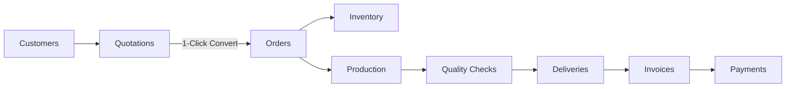

# ORVION: Intelligent Business Operations Platform

<div align="center">
  
  <h3>Intelligent Operations. Smarter Business.</h3>
  <p>A unified, deterministic, domain-driven enterprise business operations platform.</p>

  [](https://spring.io/projects/spring-boot)
  [](https://openjdk.org/)
  [](https://react.dev/)
  [](https://vitejs.dev/)
  [](https://tailwindcss.com/)
  [](https://spring.io/projects/spring-security)
  []()
  []()
  [](https://www.docker.com/)
</div>

---

## 🌟 Executive Overview

**ORVION** unifies mission-critical commercial workflows currently fragmented across spreadsheets, paper registers, and messaging apps into a single, high-performance, role-based platform.

It orchestrates the entire operational lifecycle from customer onboarding to quotation generation, atomic sales order conversion, inventory locking, shop floor manufacturing runs, delivery tracking, and BigDecimal financial settlement.

### Core Architectural Guarantees

- **Domain-Driven Modular Monolith**: Strictly organized inside `com.orvion.domain.<domain>`.
- **Authoritative RBAC**: All business operations are guarded at the Spring Security `@PreAuthorize` level.
- **Deterministic Math**: Every financial amount, tax, discount, and balance uses `BigDecimal` with explicit scale (2 decimal places) and `RoundingMode.HALF_UP` (zero floating-point drift).
- **Zero AI Hallucinations**: 100% deterministic business logic without black-box predictive services.
- **Luminous Acrylic Glassmorphism**: Interactive 3D miniature business environment, constellation mesh animations, and frosted glass interfaces.

---

## 🔄 End-to-End Operational Lifecycle



1. **Customers**: B2B master records with credit limits, tax credentials, and duplicate checks.
2. **Quotations**: Line-item estimates with OpenPDF export and instant 1-click conversion to orders.
3. **Orders**: Pipeline tracking with status progression (`PENDING` → `PROCESSING` → `IN_PRODUCTION` → `SHIPPED` → `COMPLETED`).
4. **Inventory**: Real-time stock ledger, warehouse rack bin tracking (`RACK-A1`), reservations, and low-stock alerts.
5. **Production**: Shop floor manufacturing runs, material allocations, yield tracking, and technician assignments.
6. **Quality Assurance**: Tolerance certificates, defect inspection logs (`PASSED`, `REWORK_REQUIRED`, `REJECTED`).
7. **Deliveries**: Waybill generation (`TRK-XXXXX`), carrier driver allocation, and doorstep handoff verification.
8. **Invoices**: Compliant tax invoices generated from orders with automated balance deduction.
9. **Payments**: Partial/full payment records reconciled with `BigDecimal` accuracy.
10. **Audit Logs**: Immutable log recording all security and transactional events across the enterprise.

---

## 🛠️ Technology Stack

### Frontend

- **Framework**: React 19 + TypeScript + Vite 8
- **Styling**: Tailwind CSS v4 + Luminous Acrylic Glassmorphism Design System
- **Visuals & 3D**: Interactive 3D CSS Perspective Matrix, HTML5 Constellation Canvas & Aurora Mesh
- **Charts**: Recharts (Dual Glowing Neon Area Curves, Multi-Gradient Bar Charts, Donut Segments)
- **Icons**: Lucide React
- **HTTP Client**: Axios with JWT Bearer Interceptors & Auto 401 Redirects

### Backend

- **Framework**: Java 21 LTS + Spring Boot 3.2.4
- **Security**: Spring Security 6 + JWT (HS512) Authentication + BCrypt
- **Persistence**: Spring Data JPA + Hibernate
- **Database**: Dual Profile Setup — H2 for zero-config local development; PostgreSQL for Docker/production
- **Document Engine**: OpenPDF for direct vector document rendering
- **Validation**: Jakarta Bean Validation (`@Valid`)
- **Observability**: Spring Boot Actuator + Prometheus metrics endpoint

### Infrastructure & DevOps

- **Containerization**: Docker multi-stage builds (backend: Maven → JRE Alpine; frontend: Node → Nginx Alpine)
- **Orchestration**: Docker Compose with health checks, named volumes, and profile-based observability
- **Monitoring**: Prometheus v2.55 + Grafana 11.3 (opt-in via `observability` profile)
- **CI/CD**: GitHub Actions (Java 21 Temurin + Node 20 build verification)

---

## 📁 Repository Structure

```text
orvion/
├── .github/
│   └── workflows/
│       └── ci.yml                    # Automated GitHub CI pipeline
├── backend/                          # Spring Boot 3.2 Java 21 Monolith
│   ├── Dockerfile                    # Multi-stage: Maven build → JRE Alpine runtime
│   ├── .dockerignore
│   ├── pom.xml
│   ├── mvnw & mvnw.cmd
│   └── src/main/java/com/orvion/
│       ├── common/                   # Shared DTOs, security context, exceptions
│       ├── config/                   # Security, JWT, CORS, OpenAPI Swagger
│       ├── security/                 # JWT and authentication support
│       └── domain/                   # Encapsulated Business Domains
│           ├── analytics/          ├── audit/          ├── auth/
│           ├── customer/           ├── delivery/       ├── employee/
│           ├── inventory/          ├── invoice/        ├── notification/
│           ├── order/              ├── payment/        ├── product/
│           ├── production/         ├── quality/        ├── quotation/
│           ├── supplier/           └── user/
├── frontend/                         # React 19 + Vite + TypeScript Client
│   ├── Dockerfile                    # Multi-stage: Node build → Nginx Alpine
│   ├── nginx.conf                    # Reverse proxy config (API passthrough)
│   ├── .dockerignore
│   ├── package.json
│   ├── vite.config.ts
│   └── src/
│       ├── components/               # Hero 3D Ecosystem, Constellation Canvas, Shell
│       ├── contexts/                 # AuthContext & RBAC state
│       ├── lib/                      # Axios API client
│       ├── pages/                    # Domain & Dashboard views
│       └── types/                    # Shared TypeScript interfaces
├── observability/                    # Prometheus & Grafana provisioning
│   ├── prometheus.yml                # Scrape config targeting backend metrics
│   └── grafana/provisioning/
│       └── datasources/
│           └── prometheus.yml        # Auto-provisioned Prometheus data source
├── docker-compose.yml                # Full-stack orchestration (Postgres, backend, frontend, observability)
├── .env.example                      # Template environment variables
├── .gitignore
├── AGENTS.md                         # Architecture & coding directives
└── README.md
```

---

## ⚙️ Quick Start

### Option A: Local Development (without Docker)

#### Prerequisites

- **Java SDK**: Java 21 LTS or higher
- **Node.js**: v18+ (Node 20+ recommended) with npm

#### Step 1: Start the Backend (Spring Boot API)

The default Spring profile is `h2`, so no database setup is required.

```bash
cd backend

# Windows:
.\mvnw.cmd spring-boot:run

# macOS / Linux:
./mvnw spring-boot:run
```

The API starts at `http://localhost:8080`.

#### Step 2: Start the Frontend (React + Vite)

In a second terminal:

```bash
cd frontend
npm install
npm run dev
```

Open `http://localhost:5173`. Vite proxies `/api` requests to the backend.

#### Useful Backend URLs (Local Dev)

| Resource | URL |
| --- | --- |
| Swagger UI | `http://localhost:8080/swagger-ui.html` |
| OpenAPI JSON | `http://localhost:8080/v3/api-docs` |
| H2 Console | `http://localhost:8080/h2-console` |
| Health Check | `http://localhost:8080/actuator/health` |
| Prometheus Metrics | `http://localhost:8080/actuator/prometheus` |

The H2 console uses the development defaults: username `sa` with a blank password.

---

### Option B: Docker Deployment (Recommended for Full-Stack)

#### Prerequisites

> **⚠️ Docker Desktop (or Docker Engine + Docker Compose) must be installed and running** before executing any `docker compose` commands. Download it from [docker.com/get-docker](https://docs.docker.com/get-docker/).
>
> Verify your installation:
> ```bash
> docker --version        # e.g. Docker version 27.x
> docker compose version  # e.g. Docker Compose version v2.x
> ```

No other dependencies (Java, Node.js, npm) are needed — everything is built inside containers.

#### Zero-Config Start

```bash
git clone <repository-url>
cd orvion
docker compose up --build
```

Everything starts with sensible defaults:

| Service | Address |
| --- | --- |
| Frontend (React + Nginx) | `http://localhost:5173` |
| Backend API | `http://localhost:8080` |
| PostgreSQL | `localhost:5432` |
| Swagger UI | `http://localhost:8080/swagger-ui.html` |

The backend seeds demo accounts (see [Demo Accounts](#-demo-accounts-pre-configured-seed-data) below) on first startup. Uploaded files and database data persist in Docker volumes across restarts.

#### Enable Observability (Prometheus + Grafana)

```bash
docker compose --profile observability up --build
```

| Service | Address | Credentials |
| --- | --- | --- |
| Prometheus | `http://localhost:9090` | — |
| Grafana | `http://localhost:3000` | admin / `admin` |

Prometheus is pre-configured to scrape the backend's `/actuator/prometheus` endpoint. Grafana auto-provisions Prometheus as a data source.

#### Stop & Clean Up

```bash
# Stop all services (preserves data volumes)
docker compose down

# Stop and remove all data (database, uploads)
docker compose down -v
```

> **Optional ML service:** The backend references `ORVION_ML_BASE_URL` (defaults to `http://ml-service:8000`), but no ML service is included in this repository. The application runs fine without it — ML endpoints will return errors if called, but core features work normally.

---

## 🔧 Configuration

The defaults in `docker-compose.yml` work out-of-the-box — no `.env` file is required. To customize values, copy `.env.example` to `.env` and edit:

```bash
cp .env.example .env
```

| Variable | Purpose | Default |
| --- | --- | --- |
| `PORT` | Application port template value | `8080` |
| `DB_HOST` | PostgreSQL host | `postgres` (in Compose) |
| `DB_PORT` | PostgreSQL port | `5432` |
| `DB_NAME` | Database name | `orvion_db` |
| `DB_USERNAME` | Database user | `orvion_user` |
| `DB_PASSWORD` | Database password | `orvion_secure_password_123` |
| `SPRING_PROFILES_ACTIVE` | Spring profile | `h2` locally, `postgres` in Compose |
| `JWT_SECRET` | JWT signing secret | Development fallback only |
| `JWT_EXPIRATION_MS` | JWT lifetime (ms) | `86400000` (24 hours) |
| `STORAGE_LOCATION` | Upload directory | `./uploads` locally, `/app/uploads` in Docker |
| `ORVION_ML_BASE_URL` | Optional ML service URL | `http://ml-service:8000` |
| `ORVION_ML_TIMEOUT_MS` | Optional ML request timeout (ms) | `8000` |
| `VITE_API_BASE_URL` | Frontend API URL template | `http://localhost:8080/api/v1` |

The Vite dev server uses a relative `/api/v1` URL with a proxy to the backend; `VITE_API_BASE_URL` is present in `.env.example` but is not currently read by the frontend in dev mode.

> ⚠️ **Security**: Do not use the committed fallback secrets or database credentials outside local development. Set strong, unique values for `JWT_SECRET` and `DB_PASSWORD` in any deployed environment.

---

## 🌐 API Surface

The REST API is rooted at `/api/v1`. Implemented controller groups:

`/auth`, `/customers`, `/suppliers`, `/products`, `/inventory`, `/quotations`, `/orders`, `/production`, `/quality-checks`, `/deliveries`, `/invoices`, `/payments`, `/notifications`, and `/audit-logs`.

The frontend also contains employee and dashboard views. Their backend integrations should be verified before treating those views as production-ready API contracts.

---

## 👥 Demo Accounts (Pre-configured Seed Data)

All pre-seeded test accounts use password: **`Password123!`**

| Role | Email | Domain Access & Permissions |
| :--- | :--- | :--- |
| **Super Admin** | `admin@orvion.com` | Full unrestricted governance & audit log oversight |
| **Business Admin** | `business.admin@orvion.com` | Organizational management & operations visibility |
| **Sales Manager** | `sales@orvion.com` | Customer CRM, Quotations, and Order approvals |
| **Inventory Manager** | `inventory@orvion.com` | Warehouse racks, stock adjustments, and supplier records |
| **Production Manager** | `production@orvion.com` | Shop floor manufacturing runs, material allocations & QC |
| **Accountant** | `accountant@orvion.com` | Invoicing, BigDecimal precision balance & payments |
| **Delivery Manager** | `delivery@orvion.com` | Waybill dispatches, logistics, and carrier tracking |
| **Employee** | `employee@orvion.com` | Assigned tasks and internal operational notifications |

*(A discrete **Tester Switcher** is also available in the bottom-right corner of the landing page for quick 1-click role testing.)*

These credentials are for local testing only.

---

## 🧪 Build & Verification Commands

```bash
# Backend: compile and run tests
cd backend
./mvnw clean test              # Full test suite
./mvnw clean test-compile      # Compile-only verification

# Frontend: lint and build
cd frontend
npm run lint
npm run build
```

On Windows, use `.\mvnw.cmd` instead of `./mvnw`.

---

## 📄 License

This project is licensed under the MIT License.
