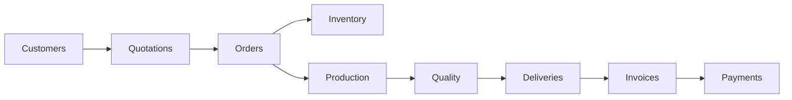

# ORVION Business Operations Platform

ORVION is a role-based business operations platform for managing the flow from customers and quotations through orders, inventory, production, quality checks, delivery, invoicing, payments, and audit history.

The repository is a modular monolith backend with a React client:

- **Backend:** Java 21, Spring Boot 3.2.4, Spring Security/JWT, Spring Data JPA, Hibernate, Bean Validation, OpenPDF, and Actuator/Prometheus metrics.
- **Frontend:** React 19, TypeScript, Vite 8, Tailwind CSS v4, Axios, Recharts, Lucide React, and Three.js.
- **Databases:** H2 for the default zero-configuration profile and PostgreSQL for the Docker profile.
- **Architecture:** Domain modules are organized below `com.orvion.domain.<domain>`. Monetary values use `BigDecimal` rather than floating-point types.

## Features

- Customer and supplier records
- Product catalog and inventory transactions
- Quotations, PDF export, and quotation-to-order conversion
- Order status tracking
- Production orders and quality checks
- Deliveries and delivery status updates
- Invoices and PDF export
- Partial and full payment recording
- Notifications and audit logs
- JWT authentication with role-based access control
- Dashboard, charts, and protected frontend routes

## Workflow



## Repository Structure

```text
orvion/
├── backend/
│   ├── pom.xml
│   └── src/main/java/com/orvion/
│       ├── common/                 # Shared DTOs, exceptions, and utilities
│       ├── config/                 # Security, CORS, and OpenAPI configuration
│       ├── security/               # JWT and authentication support
│       └── domain/                 # Business modules
│           ├── analytics/          ├── audit/          ├── auth/
│           ├── customer/           ├── delivery/       ├── employee/
│           ├── inventory/           ├── invoice/        ├── notification/
│           ├── order/              ├── payment/        ├── product/
│           ├── production/         ├── quality/        ├── quotation/
│           ├── supplier/           └── user/
├── frontend/
│   ├── package.json
│   └── src/                        # Pages, components, auth context, API client
├── observability/                  # Prometheus and Grafana provisioning
├── docker-compose.yml
├── .env.example
└── README.md
```

## Local Development

### Prerequisites

- Java 21 or newer
- Node.js and npm (Node 20 or newer recommended)
- Docker Desktop is only required for the PostgreSQL/observability workflow

### Start the backend with H2

The default Spring profile is `h2`, so no database setup is required.

```powershell
cd backend
.\mvnw.cmd spring-boot:run
```

On macOS or Linux, use `./mvnw spring-boot:run` instead. The API starts at `http://localhost:8080`.

### Start the frontend

In a second terminal:

```powershell
cd frontend
npm install
npm run dev
```

Open `http://localhost:5173`. Vite proxies `/api` requests to the backend at `http://localhost:8080`.

### Useful backend URLs

| Resource | URL |
| --- | --- |
| Swagger UI | `http://localhost:8080/swagger-ui.html` |
| OpenAPI JSON | `http://localhost:8080/v3/api-docs` |
| H2 console | `http://localhost:8080/h2-console` |
| Health | `http://localhost:8080/actuator/health` |
| Prometheus metrics | `http://localhost:8080/actuator/prometheus` |

The H2 console uses the development defaults configured by the active profile: username `sa` and a blank password.

## Quick Start (Docker)

**Zero configuration required.** Just clone and run:

```bash
git clone <repository-url>
cd orvion
docker compose up --build
```

Everything starts with sensible defaults:

| Service | Address |
| --- | --- |
| Frontend (React + Nginx) | `http://localhost:5173` |
| Backend API | `http://localhost:8080` |
| PostgreSQL | `localhost:5432` |
| Swagger UI | `http://localhost:8080/swagger-ui.html` |

The backend seeds demo accounts (see [Demo Accounts](#demo-accounts) below) on first startup. Uploaded files and database data persist in Docker volumes across restarts.

To include **Prometheus** and **Grafana** for observability:

```bash
docker compose --profile observability up --build
```

They are available at `http://localhost:9090` and `http://localhost:3000`. The default Grafana development password is `admin`.

> **Optional ML service:** The backend references `ORVION_ML_BASE_URL` (defaults to `http://ml-service:8000`), but no ML service is included in this repository. The application runs fine without it — ML endpoints will return errors if called, but core features work normally.

## Configuration

The defaults in `docker-compose.yml` work out-of-the-box — no `.env` file is required. To customize values, copy `.env.example` to `.env` and edit:

```bash
cp .env.example .env
```

Supported variables:

| Variable | Purpose | Default |
| --- | --- | --- |
| `PORT` | Application port template value | `8080` |
| `DB_HOST` | PostgreSQL host | `postgres` in Compose |
| `DB_PORT` | PostgreSQL port | `5432` |
| `DB_NAME` | Database name | `orvion_db` |
| `DB_USERNAME` | Database user | `orvion_user` |
| `DB_PASSWORD` | Database password | `orvion_secure_password_123` |
| `SPRING_PROFILES_ACTIVE` | Spring profile | `h2` locally, `postgres` in Compose |
| `JWT_SECRET` | JWT signing secret | Development fallback only |
| `JWT_EXPIRATION_MS` | JWT lifetime | `86400000` |
| `STORAGE_LOCATION` | Upload directory | `./uploads` locally |
| `ORVION_ML_BASE_URL` | Optional ML service URL | `http://localhost:8000` |
| `ORVION_ML_TIMEOUT_MS` | Optional ML request timeout | `8000` |
| `VITE_API_BASE_URL` | Frontend API URL template | `http://localhost:8080/api/v1` |

The current Vite development configuration uses a relative `/api/v1` URL and proxies it to the backend; `VITE_API_BASE_URL` is present in `.env.example` but is not currently read by the frontend.

Do not use the committed fallback secrets or database credentials outside local development.

## API Surface

The REST API is rooted at `/api/v1`. Implemented controller groups include:

`/auth`, `/customers`, `/suppliers`, `/products`, `/inventory`, `/quotations`, `/orders`, `/production`, `/quality-checks`, `/deliveries`, `/invoices`, `/payments`, `/notifications`, and `/audit-logs`.

The frontend also contains employee and dashboard views. Their backend integrations should be checked before treating those views as production-ready API contracts.

## Demo Accounts

The seed data creates the following development accounts. Every account uses the password `Password123!`.

| Role | Email |
| --- | --- |
| Super Admin | `admin@orvion.com` |
| Business Admin | `business.admin@orvion.com` |
| Sales Manager | `sales@orvion.com` |
| Inventory Manager | `inventory@orvion.com` |
| Production Manager | `production@orvion.com` |
| Accountant | `accountant@orvion.com` |
| Delivery Manager | `delivery@orvion.com` |
| Employee | `employee@orvion.com` |

These credentials are for local testing only.

## Verification

```powershell
cd backend
.\mvnw.cmd clean test

cd ..\frontend
npm run lint
npm run build
```

## License

No license file is currently included in the repository. Add a license before distributing ORVION outside the project or organization.
