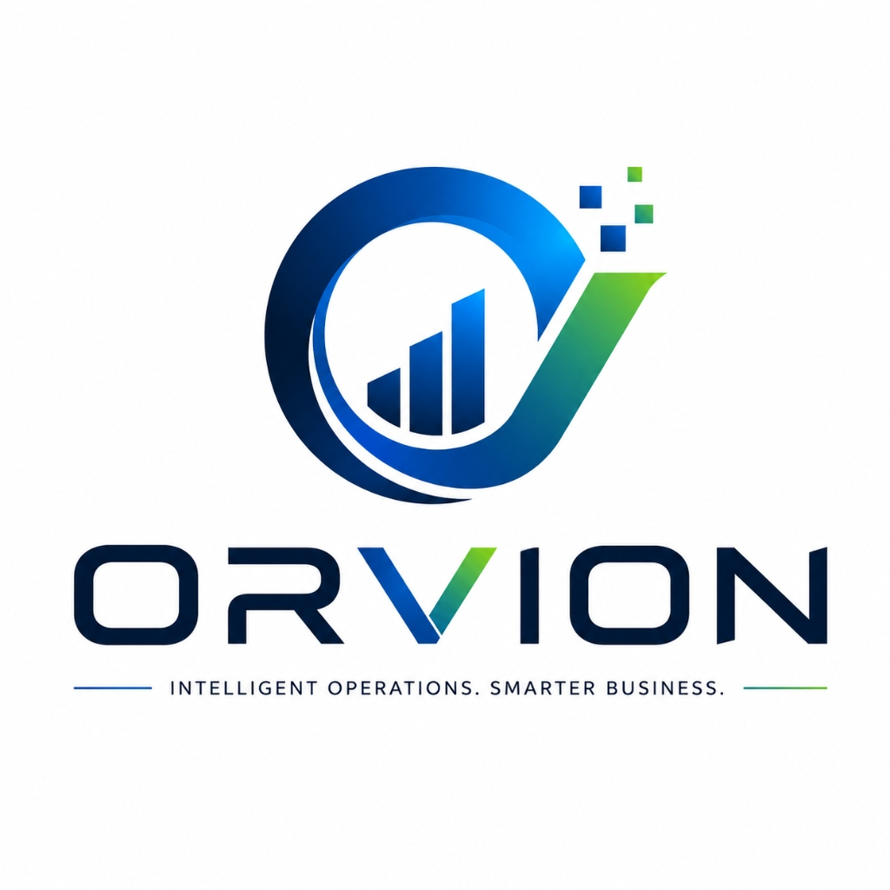
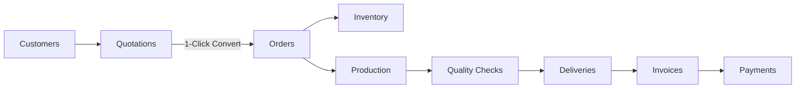

# ORVION: Intelligent Business Operations Platform

<div align="center">
  
  <h3>Intelligent Operations. Smarter Business.</h3>
  <p>A unified, deterministic, domain-driven enterprise business operations platform.</p>

  [](https://spring.io/projects/spring-boot)
  [](https://openjdk.org/)
  [](https://react.dev/)
  [](https://vitejs.dev/)
  [](https://tailwindcss.com/)
  [](https://spring.io/projects/spring-security)
  []()
  []()
</div>

---

## 🌟 Executive Overview

**ORVION** unifies mission-critical commercial workflows currently fragmented across spreadsheets, paper registers, and messaging apps into a single, high-performance, role-based platform.

It orchestrates the entire operational lifecycle from customer onboarding to quotation generation, atomic sales order conversion, inventory locking, shop floor manufacturing runs, delivery tracking, and BigDecimal financial settlement.

### Core Architectural Guarantees
- **Domain-Driven Modular Monolith**: Strictly organized inside `com.orvion.domain.<domain>`.
- **Authoritative RBAC**: All business operations are guarded at the Spring Security `@PreAuthorize` level.
- **Deterministic Math**: Every financial amount, tax, discount, and balance uses `BigDecimal` with explicit scale (2 decimal places) and `RoundingMode.HALF_UP` (zero floating-point drift).
- **Zero AI Hallucinations**: 100% deterministic business logic without black-box predictive services.
- **Luminous Acrylic Glassmorphism**: Interactive 3D miniature business environment, constellation mesh animations, and frosted glass interfaces.

---

## 🔄 End-to-End Operational Lifecycle



1. **Customers**: B2B master records with credit limits, tax credentials, and duplicate checks.
2. **Quotations**: Line-item estimates with OpenPDF export and instant 1-click conversion to orders.
3. **Orders**: Pipeline tracking with status progression (`PENDING` → `PROCESSING` → `IN_PRODUCTION` → `SHIPPED` → `COMPLETED`).
4. **Inventory**: Real-time stock ledger, warehouse rack bin tracking (`RACK-A1`), reservations, and low-stock alerts.
5. **Production**: Shop floor manufacturing runs, material allocations, yield tracking, and technician assignments.
6. **Quality Assurance**: Tolerance certificates, defect inspection logs (`PASSED`, `REWORK_REQUIRED`, `REJECTED`).
7. **Deliveries**: Waybill generation (`TRK-XXXXX`), carrier driver allocation, and doorstep handoff verification.
8. **Invoices**: Compliant tax invoices generated from orders with automated balance deduction.
9. **Payments**: Partial/full payment records reconciled with `BigDecimal` accuracy.
10. **Audit Logs**: Immutable log recording all security and transactional events across the enterprise.

---

## 🛠️ Technology Stack

### Frontend
- **Framework**: React 19 + TypeScript + Vite 8
- **Styling**: Tailwind CSS v4 + Luminous Acrylic Glassmorphism Design System
- **Visuals & 3D**: Interactive 3D CSS Perspective Matrix, HTML5 Constellation Canvas & Aurora Mesh
- **Charts**: Recharts (Dual Glowing Neon Area Curves, Multi-Gradient Bar Charts, Donut Segments)
- **Icons**: Lucide React
- **HTTP Client**: Axios with JWT Bearer Interceptors & Auto 401 Redirects

### Backend
- **Framework**: Java 21 LTS + Spring Boot 3.2.4
- **Security**: Spring Security 6 + JWT (HS512) Authentication + BCrypt
- **Persistence**: Spring Data JPA + Hibernate
- **Database**: Dual Profile Setup (H2 for zero-config quick local run; PostgreSQL for production)
- **Document Engine**: OpenPDF for direct vector document rendering
- **Validation**: Jakarta Bean Validation (`@Valid`)

---

## 📁 Repository Structure

```
Orvion/
├── .github/
│   └── workflows/
│       └── ci.yml                    # Automated GitHub CI pipeline
├── backend/                          # Spring Boot 3.2 Java 21 Monolith
│   ├── pom.xml
│   ├── mvnw & mvnw.cmd
│   └── src/main/java/com/orvion/
│       ├── common/                   # Shared DTOs, security context, exceptions
│       ├── config/                   # Security, JWT, CORS, OpenAPI Swagger
│       └── domain/                   # 12 Encapsulated Business Domains
│           ├── analytics/
│           ├── audit/
│           ├── customer/
│           ├── delivery/
│           ├── employee/
│           ├── inventory/
│           ├── invoice/
│           ├── notification/
│           ├── order/
│           ├── payment/
│           ├── product/
│           ├── production/
│           ├── quality/
│           ├── quotation/
│           └── supplier/
├── frontend/                         # React 19 + Vite + TypeScript Client
│   ├── package.json
│   ├── vite.config.ts
│   └── src/
│       ├── components/               # Hero 3D Ecosystem, Constellation Canvas, Shell
│       ├── contexts/                 # AuthContext & RBAC state
│       ├── lib/                      # Axios API client
│       ├── pages/                    # 15 Domain & Dashboard views
│       └── types/                    # Shared TypeScript interfaces
├── .env.example                      # Template environment variables
├── .gitignore                        # Comprehensive root gitignore
├── AGENTS.md                         # Architecture & coding directives
└── README.md
```

---

## ⚙️ Quick Start

### Prerequisites
- **Node.js**: v18+ (Node 20+ recommended)
- **Java SDK**: Java 21 LTS or higher

---

### Step 1: Start the Backend (Spring Boot API)

```bash
cd backend
# Windows:
.\mvnw.cmd spring-boot:run

# macOS / Linux:
./mvnw spring-boot:run
```

- API server starts on: **`http://localhost:8080`**
- H2 Web Console: **`http://localhost:8080/h2-console`**
- Swagger OpenAPI: **`http://localhost:8080/swagger-ui.html`**

---

### Step 2: Start the Frontend (React + Vite)

In a new terminal window:

```bash
cd frontend
npm install
npm run dev
```

- Web application launches on: **`http://localhost:5173`**

---

## 👥 Demo Accounts (Pre-configured Seed Data)

All pre-seeded test accounts use password: **`Password123!`**

| Role | Email | Domain Access & Permissions |
| :--- | :--- | :--- |
| **Super Admin** | `admin@orvion.com` | Full unrestricted governance & audit log oversight |
| **Business Admin** | `business.admin@orvion.com` | Organizational management & operations visibility |
| **Sales Manager** | `sales@orvion.com` | Customer CRM, Quotations, and Order approvals |
| **Inventory Manager** | `inventory@orvion.com` | Warehouse racks, stock adjustments, and supplier records |
| **Production Manager**| `production@orvion.com` | Shop floor manufacturing runs, material allocations & QC |
| **Accountant** | `accountant@orvion.com` | Invoicing, BigDecimal precision balance & payments |
| **Delivery Manager** | `delivery@orvion.com` | Waybill dispatches, logistics, and carrier tracking |
| **Employee** | `employee@orvion.com` | Assigned tasks and internal operational notifications |

*(A discrete **Tester Switcher** is also available in the bottom-right corner of the landing page for quick 1-click role testing).*

---

## 🧪 Build & Verification Commands

```bash
# Verify Backend Build
cd backend
./mvnw clean test-compile

# Verify Frontend Production Bundle
cd frontend
npm run build
```

---

## 📄 License

This project is licensed under the MIT License.
